# Projeto Engenharia de Áudio

O objetivo do projeto era de desenvolver um sintetizador analógico. Nas seções a seguir, são abordados os componentes estudados, simulados e montados em laboratório.

Na pasta [Vídeos](Vídeos) é possível visualizar o funcionamento dos módulos construídos.

- [Low-Frequency Oscillator](#1-low-frequency-oscillator-lfo)
- [Voltage Controlled Filter](#2-voltage-controlled-filter-vcf)
- [Voltage Controlled Oscillator](#3-voltage-controlled-oscillator-vco)
- [Gerador de Envelope (ADSR)](#4-attack-decay-sustain-release-adsr)

## 1) Low-Frequency Oscillator (LFO)

Um LFO (Low-Frequency Oscillator) é um oscilador de baixa frequência usado em sintetizadores para modular algum parâmetro do som, ou seja, para fazer esse parâmetro variar ao longo do tempo de forma cíclica. O LFO, dependendo da sua construção, pode produzir os seguintes formatos de onda:
- Senoide;
- Triangular;
- Dente de Serra;
- Quadrada (para ligar/desligar de forma brusca).

O LFO utilizado no projeto se trata de um oscilador auxiliar baseado em um dos inversores do CD40106 Schmitt Trigger. Sua função é gerar um pulso periódico usado para sincronizar outro oscilador, o VCO (Voltage Controlled Oscillator. Para o LFO, foi utilizado o circuito descrito no vídeo [DIY Synth-40106 Oscillator with Sync](https://www.youtube.com/watch?v=FT-08mk-UgM).

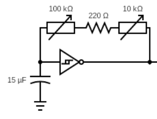

### 1.1) Princípio de Funcionamento

#### 1.1.1) Controle da Frequência

O sistema do LFO atua com base no princípio de carregamento e descarregamento do capacitor de $15 \ \mu F$acoplado ao ground. Junto com os potenciômetros, ele define a velocidade da oscilação da seguinte forma:
- Quanto maior a resistência total, mais lentamente ele carregará. Isso resulta em uma frequência mais baixa;
- Quanto menor a resistência total, mais rapidamente ele carregará. Isso resulta em uma frequência mais alta;

Para ambos os potenciômetros, temos dois tipos de ajuste/controle:
- **Coarse (100k)**: Se trata de um ajuste forte, mais intenso. Altera a frequência de forma ampla;
- **Fine (10k)**: Se trata de um ajuste fino. Permite ajustes mais precisos.

Essa combinação permite ao oscilador ir desde ciclos extremamente lentos até mais rápidos, dependendo dos valores.

#### 1.1.2) Geração da Onda Quadrada

O CD40106 tem histerese, ou seja, ele muda o estado de saída apenas quando o capacitor alcança certos limites (limite alto e baixo). Isso cria um oscilador de onda quadrada com as seguintes características:
- Quando a tensão do capacitor sobe acima do limiar, a saída vai para LOW (baixa);
- Quando cai abaixo do limiar, a saída vai para HIGH (alta).

#### 1.1.3) Controle do VCO

A saída do LFO (onda quadrada) passa pelo diodo. Em cada borda (dependendo da polaridade do diodo), ele puxa o nó do primeiro capacitor do VCO para perto de Vcc ou para perto de 0 V, ou seja, injeta ou remove carga do capacitor do VCO.

### 1.2) Simulação no LTspice

Antes da montagem do circuito, foi elaborado seu esquemático no software LTspice. Como o programa não disponibiliza componentes como potenciômetros e Schmitt triggers, algumas adaptações foram necessárias.

No caso dos potenciômetros, utilizaram-se resistores de valor equivalente. Embora essa solução não permita simular a variação contínua da resistência, ela possibilita a análise do circuito considerando o valor máximo do potenciômetro.

Para substituir o Schmitt trigger, empregou-se um circuito equivalente composto por um amplificador operacional genérico do LTspice, um resistor de $100 \ k \Omega$, outro de $470 \ k \Omega$ e uma fonte de alimentação de 5 V.

A alimentação do circuito foi realizada por meio de uma fonte de tensão senoidal.

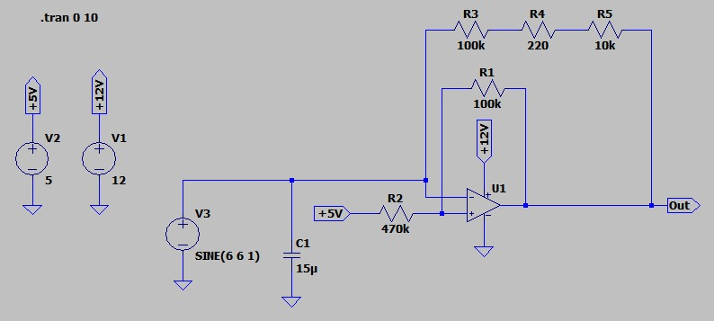

O gráfico a seguir, ilustra o resultado da simulação.

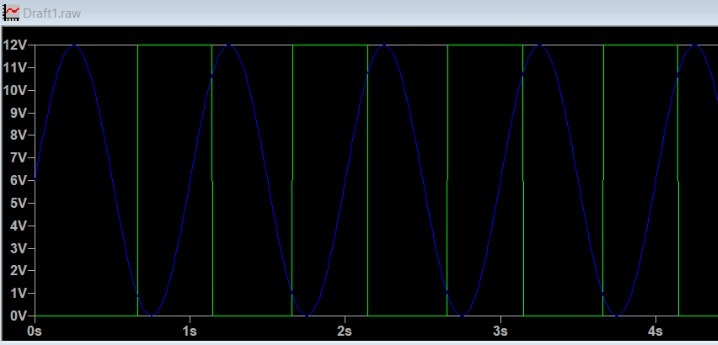

Como podemos observar, o circuito recebe uma entrada senoidal (em azul) e produz uma saída na forma de uma onda quadrada (em verde). Esse resultado demonstra que a simulação produz um resultado esperado.

### 1.3) Montagem do Circuito

A montagem do circuito foi feita utilizando os componentes especificados no vídeo de referência:
- 1 chip CD40106 (Schmitt Trigger);
- 1 potenciômetro de 100k Ω;
- 1 potenciômetro de 10k Ω;
- 1 resistor de 220 Ω;
- 1 capacitor de $15 \mu F$;
- Conectores para protoboard;

A montagem co circuito ficou da seguinte forma:

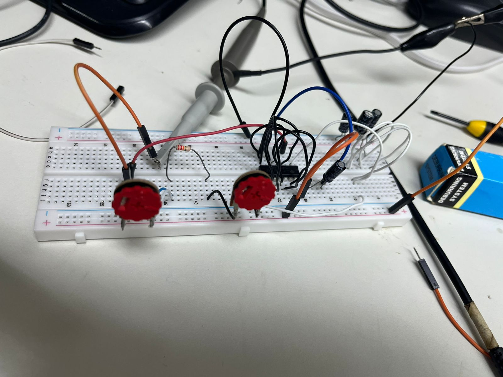

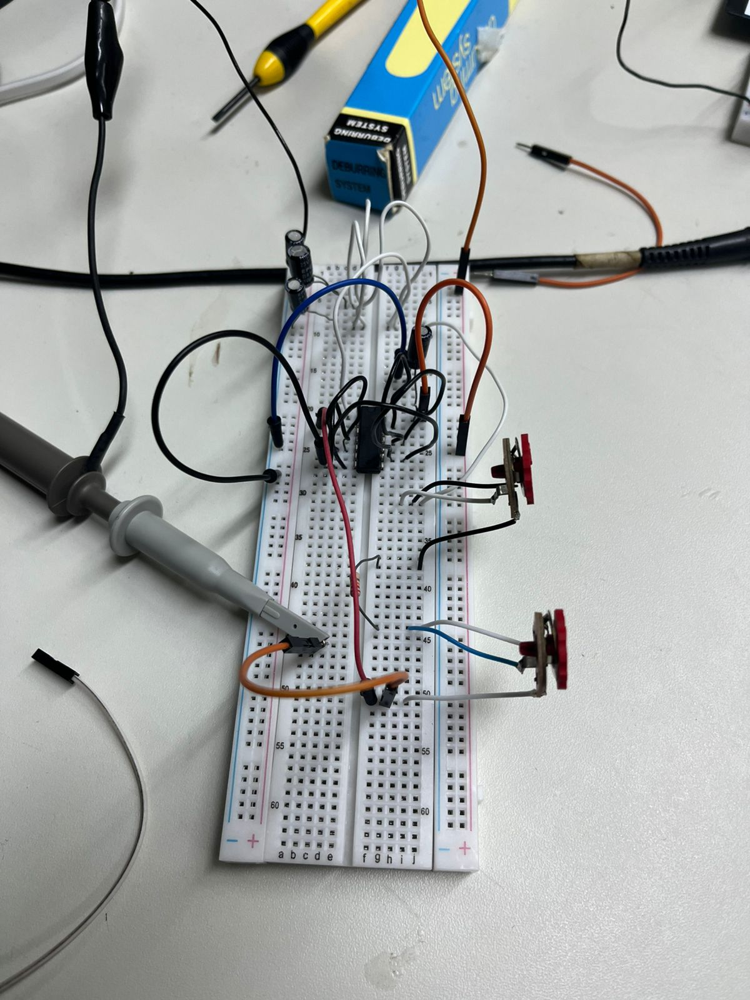

O circuito funcionou conforme o esperado, produzindo a onda quadrada desejada. Nas figuras a seguir, nota-se que, ao ajustar a resistência nos potenciômetros, a largura dos pulsos da onda quadrada também é ajustada.

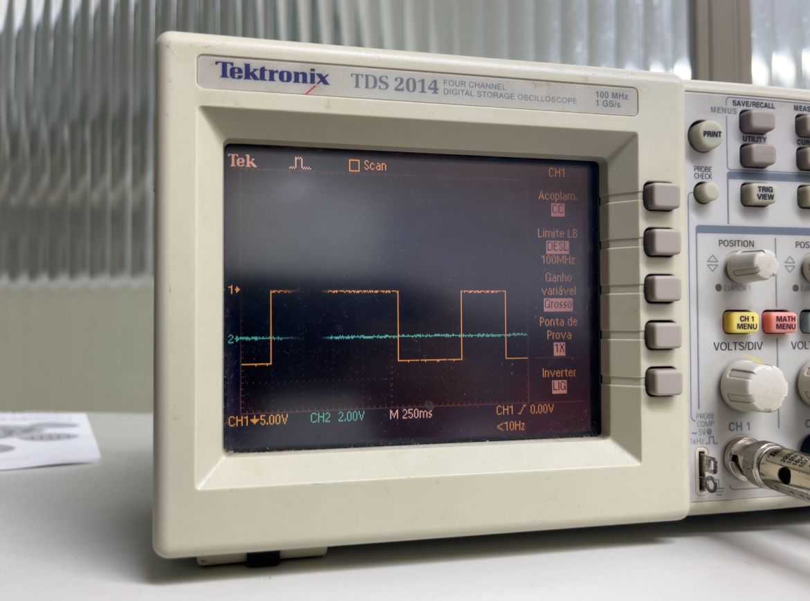
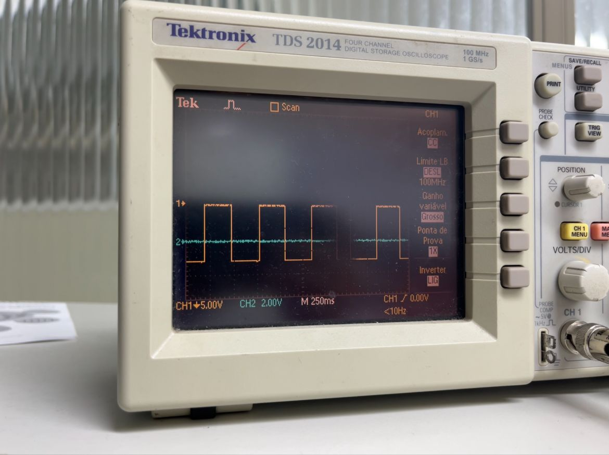

Como podemos observar, esta saída esta alinhada com o que se espera do circuito e também com a simulação apresentada anteriormente.

Os dois vídeos na pasta do projeto ilustram esse funcionamento de melhor forma.

## 2) Voltage Controlled Filter (VCF)

Um VCF (Voltage Controlled Filter) é um filtro cuja frequência de corte pode ser modificada por uma tensão de controle. Em vez de ajustar a frequência manualmente com um potenciômetro, é possível modulá-la com sinais externos como LFOs, envelopes, sequenciadores ou qualquer outra fonte de tensão. Isso permite que o filtro se torne um elemento dinâmico no fluxo do sintetizador, alterando o caráter do som ao longo do tempo.

Assim como qualquer filtro, um VCF pode ser passa-baixas, passa-altas, passa-bandas ou uma combinação ajustável entre eles. A diferença fundamental é que ele responde à tensão, o que o torna especialmente útil na síntese subtrativa, onde controlar a abertura e fechamento do filtro é tão importante quanto escolher a forma de onda. Para este trabalho, foi utilizado o VCF do tipo KS-20, disponível no link [Filtro KS-20](https://kassu2000.blogspot.com/2019/07/ks-20-filter.html).

### 2.1) Filtro KS-20

O KS-20 é um VCF baseado no clássico filtro do Korg MS-20, mas reconstruído com OTAs (Operational Transconductance Amplifiers) em vez do par de transistores do circuito original. Ele é formado por duas etapas de filtragem idênticas, cada uma construída em torno de um OTA configurado como integrador. Nessa configuração, o OTA funciona como um resistor variável controlado por corrente: quanto maior a corrente de controle, derivada da tensão de cutoff, menor a "resistência equivalente" e maior a frequência de corte do filtro. Assim, o KS-20 se comporta como um filtro totalmente controlável por tensão, mantendo a musicalidade e a instabilidade interessante do MS-20.

As duas etapas de OTA são encadeadas para formar diferentes configurações de filtragem. Quando o sinal entra pela entrada passa-baixas, ambas as etapas atuam juntas, resultando em um filtro passa-baixas de dois pólos (aproximadamente 12 dB/oitava). Já a entrada passa-altas usa o caminho interno de modo diferente: a ressonância é criada pela primeira etapa, mas o áudio filtrado é retirado da segunda, produzindo um passa-altas de um pólo (6 dB/oitava).

A ressonância, característica marcante do MS-20, é obtida realimentando o sinal de saída para a entrada, mas no KS-20 essa realimentação é intencionalmente não linear. Em vez de diodos tradicionais, o circuito utiliza LEDs, que possuem características de condução diferentes e introduzem distorções sutis quando o nível de sinal aumenta. Isso faz com que a ressonância mude de comportamento conforme a amplitude: em níveis baixos, ela soa limpa, já em níveis altos, passa a saturar. O controle de "drive" ajusta exatamente quanto dessa saturação aparece, permitindo desde um filtro suave até um som agressivo e "rasgado". O resultado é um filtro versátil, que combina a flexibilidade dos OTAs, garantindo controle de corte suave e previsível, com a crueza e o caráter da ressonância não linear inspirada no MS-20.

### 2.2) Implementações

#### 2.2.1) Simulação no LTspice

O circuito foi montado no LTspice a partir do esquema disponível na documentação do KS-20, porém não foi possível realizar testes significativos de sua operação. A figura 1 mostra a montagem do circuito no software LTspice.

A principal dificuldade surgiu da falta de clareza quanto aos pontos adequados para inserir o sinal de entrada e sobre qual nó deveria ser considerado a saída em cada modo de funcionamento do filtro. Como o KS-20 permite diferentes caminhos internos dependendo da entrada utilizada (passa-baixas ou passa-altas), tornou-se difícil estabelecer um arranjo de excitação que representasse de forma confiável o comportamento real do circuito. Além disso, a presença de elementos não lineares na malha de realimentação, como LEDs utilizados para modelar a saturação da ressonância, exige parâmetros mais precisos para que a simulação seja fiel. Assim, embora o circuito tenha sido implementado no ambiente de simulação, não foi possível obter resultados conclusivos sobre sua resposta ou sua dinâmica.

#### 2.2.2) Montagem Física

A montagem física do KS-20 foi parcialmente realizada em uma protoboard, seguindo fielmente a lista de componentes fornecida pela referência. O circuito foi montado utilizando alguns dos componentes a seguir:
- 2 AmpOps LM13700;
- 2 AmpOps NE5532;
- 1 AmpOp TL072;
- 4 Resistores 220 Ω;
- 2 Resistores 4.7k Ω;
- 6 Resistores 10k Ω;
- 1 Resistor 47k Ω;
- 1 Resistor 100k Ω;
- 2 Capacitores 1 nF;
- 1 Capacitor 470 nF;
- 2 LEDs.

A reprodução do circuito seguiu fielmente o esquema original, sem modificações, mantendo a organização necessária para acomodar as duas etapas baseadas em OTAs e os elementos da malha de realimentação. No entanto, assim como ocorreu na simulação, não foi possível testar efetivamente o funcionamento do filtro. Alguns dos componentes chegaram próximo ao prazo final de entrega do projeto e, além disso, estavam na forma SMD. Devido às limitações de tempo, a equipe da universidade responsável pela soldagem não conseguiu realizar o serviço a tempo, impossibilitando a montagem dos componentes na protoboard por parte da equipe.

## 3) Voltage Controlled Oscillator (VCO)

O VCO (Voltage Controlled Oscillator) é uma das partes principais de um sintetizador analógico. Ele é responsável por gerar a forma de onda bruta cuja frequência é determinada por uma tensão de entrada. Em um sistema modular padrão 1V/Oct (um volt por oitava) ou seja, um aumento de 1 volt na entrada deve dobrar a frequência da saída.

Para este projeto, foi utilizada a arquitetura focada em gerar uma onda dente de serra desenvolvida por Moritz Klein para a série educacional [mki x es.EDU](https://www.ericasynths.lv/shop/diy-kits-1/mki-x-esedu-diy-system/). O autor tambem possui uma playlist no Youtube onde constroi cada seção do VCO separadamente: [DIY VCO Series](https://youtube.com/playlist?list=PLHeL0JWdJLvTuGCyC3qvx0RM39YvopVQN&si=scAYUBEbraoZ-Eum). Este design foi escolhido por equilibrar simplicidade de componentes com uma precisão de rastreamento musicalmente útil. O circuito é capaz de gerar ondas dente de serra (sawtooth) e quadrada simultaneamente. Contudo, neste projeto, se construiu o circuito responsável apenas pela onda dente de serra.

### 3.1) Princípio de Funcionamento

O funcionamento deste VCO pode ser dividido em alguns estágios principais: o estágio de entrada, o núcleo oscilador e o conversor de tensão-corrente (exponencial).

#### 3.1.1) Estágio de Entrada

Uma tensão de controle (CV) entra pelo estágio de entrada e é utilizada para controlar a tensão na base do transistor. É esperado que essa tensão esteja entre 0 V e 5 V. Contudo, A tensão de operação do transistor está na faixa de 300 mV a 500 mV. Por conta disso, resistores são organizados de forma a dividir a tensão para um limite adequado.

Dois potenciometros são utilizados na entrada para auxiliar o tunning do VCO. Eles essencialmente adicionam ou subtraem uma certa tensão à CV. Um terceiro potenciometro (trimpot) é utilizado para que o offset da tensão de entrada fique dentro da faixa de operação do transistor. 

#### 3.1.2) O Núcleo Dente de Serra

O núcleo do oscilador é baseado em um ciclo de carga e descarga de um capacitor. O circuito utiliza um inversor *Schmitt Trigger* (CD40106). O funcionamento ocorre da seguinte maneira:

1.  **Carga Rápida:** O inversor carrega o capacitor de 2.2 nF rapidamente através de um diodo, gerando a subida vertical da onda dente de serra.
2.  **Descarga Controlada:** Quando a tensão atinge o limiar superior do Schmitt Trigger, a saída do inversor vai para 0V. O diodo bloqueia o retorno da corrente, e o capacitor é forçado a descarregar através de um caminho alternativo. Nesse caso, esse caminho é provido pelo transistor
3.  **Frequência:** A velocidade dessa descarga determina a frequência da onda. Quanto mais rápida a descarga, mais agudo é o som.

#### 3.1.3) Controle de Frequência e Exponenciação

Para que o sintetizador responda musicalmente (1V/Oct), a relação entre a tensão de entrada e a frequência deve ser exponencial (já que as frequências das notas musicais dobram a cada oitava).

Como resistores comuns oferecem uma relação linear, o circuito utiliza um transistor BJT (BC548) como um "dreno de corrente" variável e controlável por tensão. A corrente que flui entre o coletor e o emissor do transistor controla a velocidade de descarga do capacitor. A física do transistor naturalmente fornece a resposta exponencial necessária: um aumento linear na tensão da base resulta em um aumento exponencial na corrente de coletor.

Para compensar a instabilidade térmica, foi implementado um par de transistores NPN (BC548) e PNP (BC558) configurados para que as derivas térmicas de um cancelem as do outro, mantendo a afinação mais estável.

### 3.2) Implementações

#### 3.2.1) Simulação no Proteus

O esquemático do VCO foi capturado no ambiente Proteus (arquivo [`VCO.pdsprj`](Esquemáticos/VCO.pdsprj)), visando validar a topologia do circuito misto que envolve lógica digital e comportamento analógico.

A simulação focou em verificar a oscilação do núcleo CD40106 e a linearidade da resposta de descarga do capacitor. O circuito simulado replica o design do manual, incluindo:

  - O loop de realimentação com o diodo e o capacitor de temporização;
  - O uso de transistores para controle de corrente;
  - Os estágios de buffer de saída com o TL074.

Durante a simulação, um ponto crítico observado foi a convergência do modelo, exigindo ajustes nos parâmetros de simulação do software.

#### 3.2.2) Montagem Física

A montagem física seguiu o diagrama elétrico fornecido no manual da mki x es.edu [VCO_MANUAL_v2.pdf](https://www.ericasynths.lv/media/VCO_MANUAL_v2.pdf).

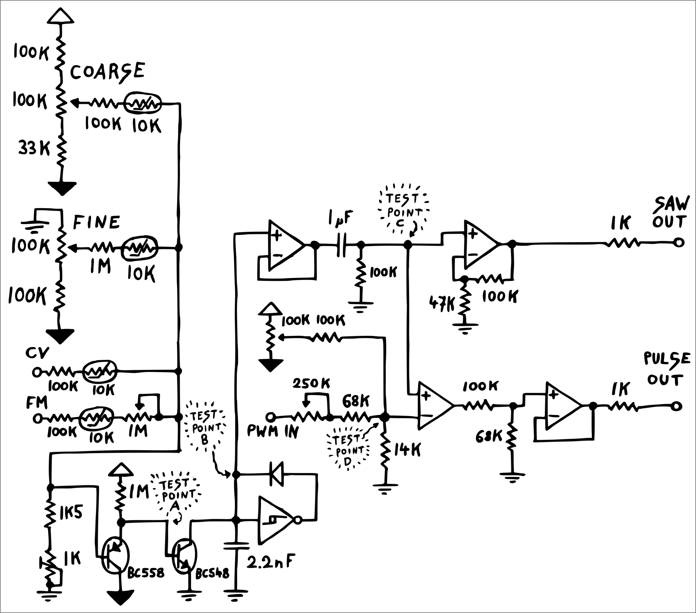

Os componentes principais utilizados foram:

- 1x CI CD40106 - Schmitt Trigger
- 1x Amplificador Operacional TL074
- 1x Capacitor de Poliester 2,2nf / 400V
- 1x Diodo 1N4148
- 1x Capacitor de Poliester 1uF / 250V
- 9x Resistor 100K 5% (1/4W)
- 1x Transistor NPN - BC548
- 1x Transistor PNP - BC558
- 2x Resistor 1M 5% (1/4W)
- 1x Resistor 1K5 5% (1/4W)
- 2x Resistor 68K 5% (1/4W)
- 1x Resistor 33K 5% (1/4W)
- 1x Resistor 13K 5% (1/4W)
- 3x Resistor 1K 5% (1/4W)
- 3x Potenciômetro Linear de 100KΩ
- 1x Trimpot Vertical 25 Voltas 3296W de 1KΩ
- 4x Sensor de Temperatura NTC 10K 5mm

*OBS.:* O NTC tem como função diminuir ruido termico no circuito. Contudo, esse componente não foi utilizado na versão final pois o modelo comprado veio com as especificações erradas por engano.

A figura abaixo ilustra o resultado final da montagem na protoboard:

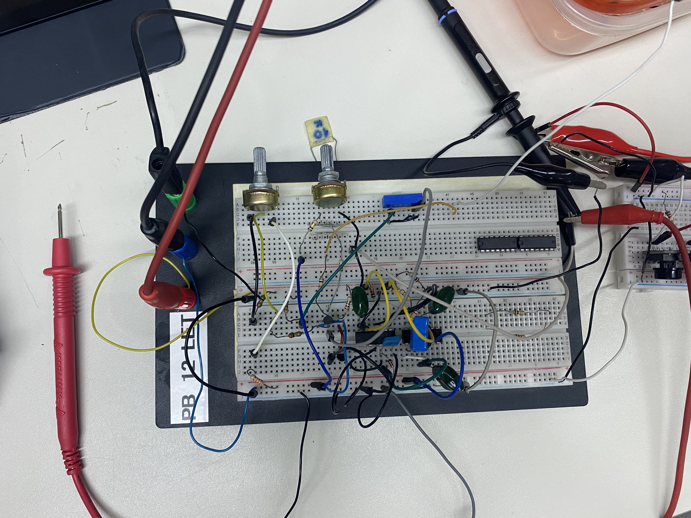
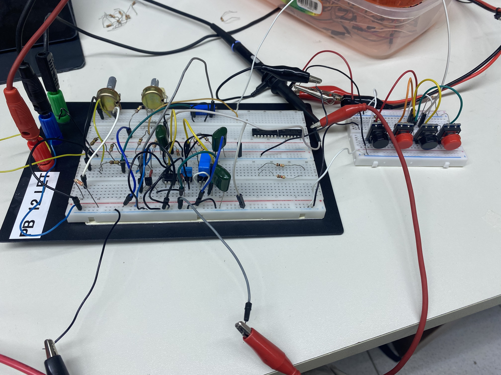

Durante os testes físicos, foi necessário realizar o procedimento de calibração descrito no manual. Utilizou-se o *trimpot* de 1k Ω para ajustar a escala de 1V/Oct, garantindo que a diferença de oitavas (ex: C1 para C2) correspondesse exatamente ao dobro da frequência.

A saída obtidas foi uma onda dente de serra nítida, com amplitude de aproximadamente 8Vpp. É possível ver um exemplo da saída do circuito no osciloscópio na imagem a seguir;

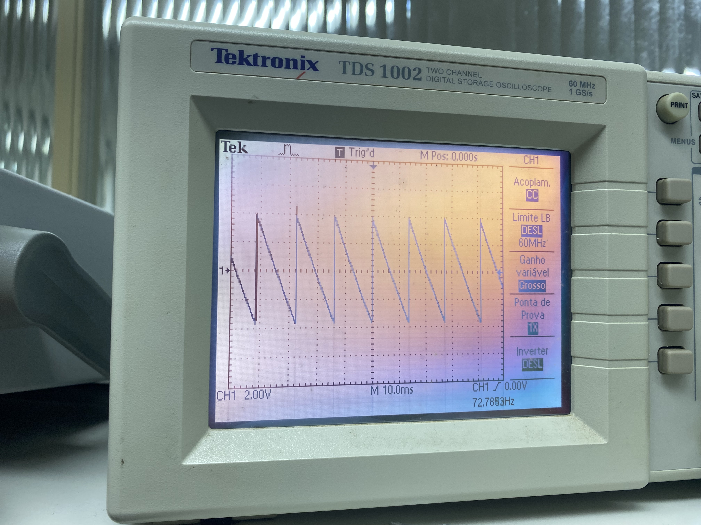

Para testar o circuito, além de utilizar a fonte de bancada e o gerador de onda para simular o sinal CV que controla o VCO, tambem se construiu um teclado rudimentar baseado em divisores de tensão:

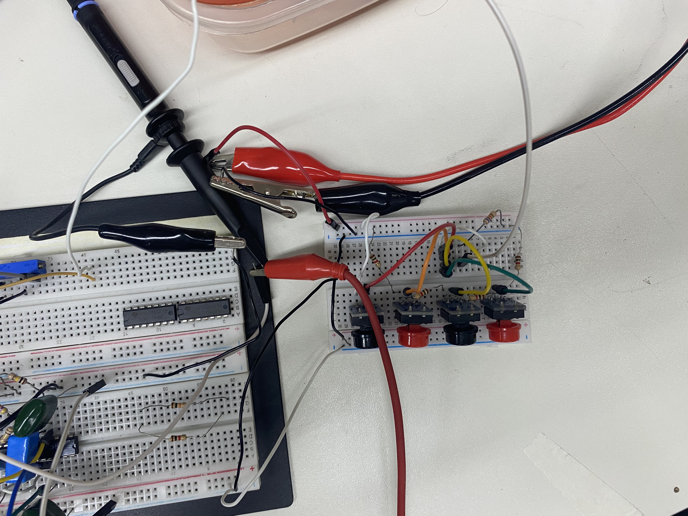

Os testes de áudio confirmaram que o oscilador responde corretamente às variações de tensão, permitindo a execução de melodias quando controlado por um ou teclado CV.

## 4) Attack Decay Sustain Release (ADSR)

O **ADSR (Attack, Decay, Sustain, Release)** é um gerador de envelope utilizado em sistemas de áudio para modelar a evolução temporal de um sinal, geralmente a amplitude, desde o instante em que é acionado até seu desligamento. Por meio das fases de ataque, decaimento, sustentação e liberação, o ADSR permite controlar como o som surge, se estabiliza e desaparece, sendo um elemento fundamental na definição do timbre e da expressividade em sintetizadores e aplicações de processamento de sinais.

Para o projeto, foi utilizado o circuito disponivel no [link](https://www.schmitzbits.de/adsr.html).

### 4.1) Princípio de Funcionamento

O gerador de envelope pode ser dividido em 4 partes

#### 4.1.1) **Attack**

O **Attack** define o tempo necessário para que o envelope evolua do nível inicial (geralmente zero) até seu valor máximo após o acionamento do sinal de controle. Esse parâmetro influencia diretamente a percepção inicial do som, podendo resultar em transientes rápidos e percussivos ou em entradas suaves e graduais.

#### 4.1.2) **Decay**

O **Decay** corresponde ao intervalo de tempo em que o envelope decai do valor máximo atingido no ataque até o nível de sustentação. Ele controla a transição entre o pico inicial e o regime estável do som, sendo responsável por definir o quanto o sinal perde intensidade após o ataque.

#### 4.1.3) **Sustain**

O **Sustain** representa o nível de amplitude mantido enquanto o sinal de controle permanece ativo. Diferentemente dos demais parâmetros, o sustain não é um tempo, mas um valor, determinando a intensidade contínua do som durante sua duração.

#### 4.1.4) **Release**

O **Release** estabelece o tempo que o envelope leva para retornar ao nível zero após o desligamento do sinal de controle. Esse parâmetro define como o som se extingue, permitindo desde cortes abruptos até decaimentos longos e naturais.

O **Release** é controlado por um potenciômetro de 10KΩ, enquanto os outros parâmetros por potenciômetros de 2.2MΩ

### 4.2) Implementação

O circuito foi simulado utilzando o _Software_ Proteus

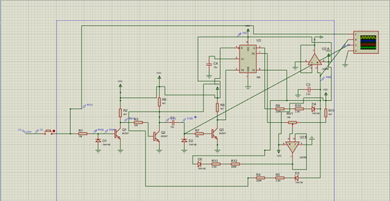

O não foi possível simular o CI recomendado pelo projeto original, ICM 7555, então ele foi substituido pelo temporizador LM 555.

A saída do envelope **ADSR** é obtida **após o amplificador operacional U2 (LM358)**, que atua no condicionamento final do sinal. Esse estágio fornece uma saída com **baixa impedância**, garantindo que a forma do envelope não seja alterada pela carga conectada ao circuito. A tensão presente nesse ponto corresponde diretamente à curva **Attack–Decay–Sustain–Release**.

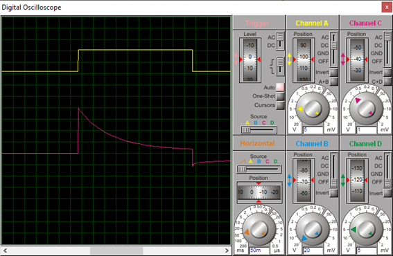

#### 4.2.1) Montagem

Os componentes utilizados foram

- 2x Capacitores de 10uF
- 1x Capacitor de 2.2uF
- 2x Resistores de 10KΩ
- 4x Resitores de 4.7KΩ
- 1x Resistor de 22KΩ
- 3x Resistores de 220Ω
- 3x Resistores de 2.2MΩ
- 2x Amplificador Operacional LM358
- 1x CI LM555
- 3x Transistores NPN BC547
- 5x Diodos 1N4148

## 5) Módulo VCA – Voltage Controlled Amplifier

Este repositório contém o desenvolvimento do **módulo VCA (Voltage Controlled Amplifier)**, projetado como parte de um **sintetizador analógico modular**.

O VCA é responsável por controlar a **amplitude de um sinal de áudio** em função de uma **tensão de controle (CV)**, sendo um dos blocos fundamentais em síntese analógica.

---

### Visão Geral

O módulo VCA foi desenvolvido de forma independente, permitindo testes e validação isolados antes de sua integração com os demais módulos do sintetizador.

Principais características:
- Implementação totalmente analógica  
- Controle de ganho por tensão (CV)  
- Operação adequada para sinais de áudio  
- Arquitetura baseada em par diferencial de transistores  

---

### Função do Módulo

O VCA aplica um ganho controlado por tensão ao sinal de áudio de entrada:

- **CV baixo:** sinal atenuado  
- **CV alto:** sinal amplificado  

Esse comportamento permite aplicações como:
- controle de volume  
- modulação de amplitude  
- uso com envelopes e LFOs  
- controle dinâmico de sinais em sistemas modulares  

---

### Entradas e Saída

- **Signal In:** entrada do sinal de áudio
  entrada ideal de onda senoidal e +- 5V (10Vpp)
- **CV In:** entrada da tensão de controle
  entrada ideal de 0V a 10V
- **Signal Out:** saída do sinal de áudio com amplitude controlada  

---

## Alimentação

O módulo opera com **alimentação simétrica**, padrão em sintetizadores analógicos modulares:

- **+12 V**  
- **–12 V**  
- **GND**

A alimentação simétrica é necessária para garantir operação linear dos amplificadores operacionais e permitir sinais AC centrados em 0 V.

---

## Arquitetura do Circuito

O circuito do VCA é composto por três blocos principais:

1. **Estágio de Controle por Tensão (CV)**  
2. **Par Diferencial de Transistores**  
3. **Estágio de Saída**

Cada bloco desempenha um papel específico no controle da amplitude do sinal.

---

## Estágio de Controle por Tensão (CV)

O sinal de **CV In** é processado por um amplificador operacional (TL082), responsável por ajustar a escala da tensão de controle e convertê-la em uma polarização adequada para o par diferencial.

Um potenciômetro permite o ajuste manual da intensidade do CV, definindo a sensibilidade do VCA.

A saída desse estágio controla a corrente aplicada ao emissor comum do par diferencial de transistores.

---

## Par Diferencial de Transistores

O núcleo do VCA é formado por um **par diferencial de transistores bipolares**:

- Um transistor recebe o **sinal de áudio**  
- O outro recebe um **ponto de referência**  

A corrente total disponível no emissor comum é definida pelo estágio de CV, controlando o ganho efetivo do módulo.

Essa topologia permite controle contínuo e suave da amplitude do sinal.

---

## Estágio de Saída

O sinal proveniente do par diferencial é aplicado a um amplificador operacional configurado como somador/amplificador.

Esse estágio é responsável por:
- converter variações de corrente em tensão  
- remover componentes DC indesejadas  
- fornecer ganho adequado  
- garantir baixa impedância de saída  

O sinal final é disponibilizado em **Signal Out**.

---

## Componentes do Circuito

Amplicadores Operacionais:

| 2 | TL082 | Amplificador operacional duplo (TL072 pode ser usado como alternativa) |

Transistores:

| 2 | 2N3904 | Transistores NPN (BC548 pode ser utilizado como equivalente) |
Resistores:
| 2 | 100 Ω | Polarização das bases |
| 2 | 10 kΩ | Entrada do estágio de saída |
| 2 | 20 kΩ | Carga dos coletores |
| 1 | 33 kΩ | Estágio de controle (CV) |
| 1 | 82 kΩ | Estágio de controle (CV) |
| 6 | 100 kΩ | Realimentação, referência e mistura de sinais |
| 2 | 470 kΩ | Realimentação do amplificador de saída |
| 1 | 1 kΩ | Resistor de saída |
Potenciômetros:
| 1 | 100 kΩ | Ajuste de nível de CV |
| 1 | 200 kΩ | Ajuste de sensibilidade / balanceamento |

## Esquemático

O esquemático final do módulo VCA foi desenvolvido no Proteus e está disponível neste repositório:

A implementação prática do circuito não atingiu o desempenho esperado, não sendo possível obter o resultado previsto nas condições de operação analisadas. A saída então foi obtida após o capacitor de 10uF, nó em que a tensão se comporta de acordo com um envelope AD(Attack, Decay).
