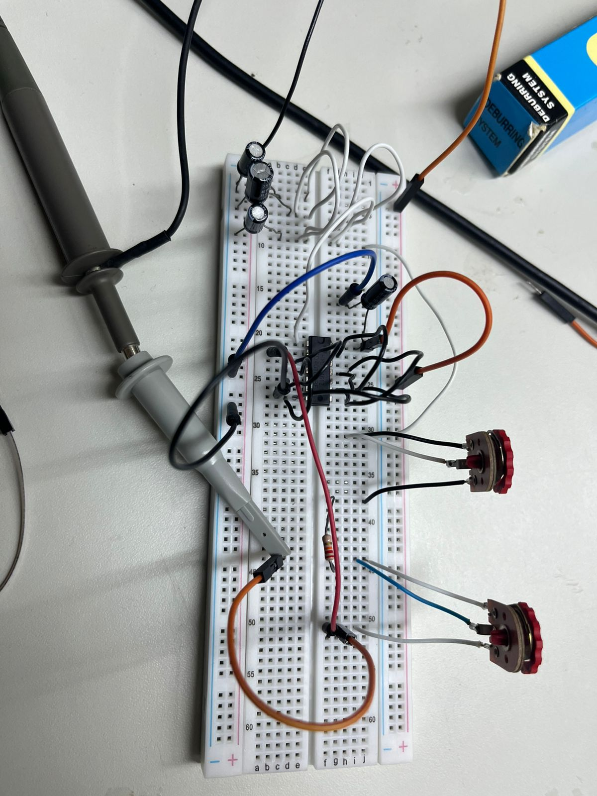
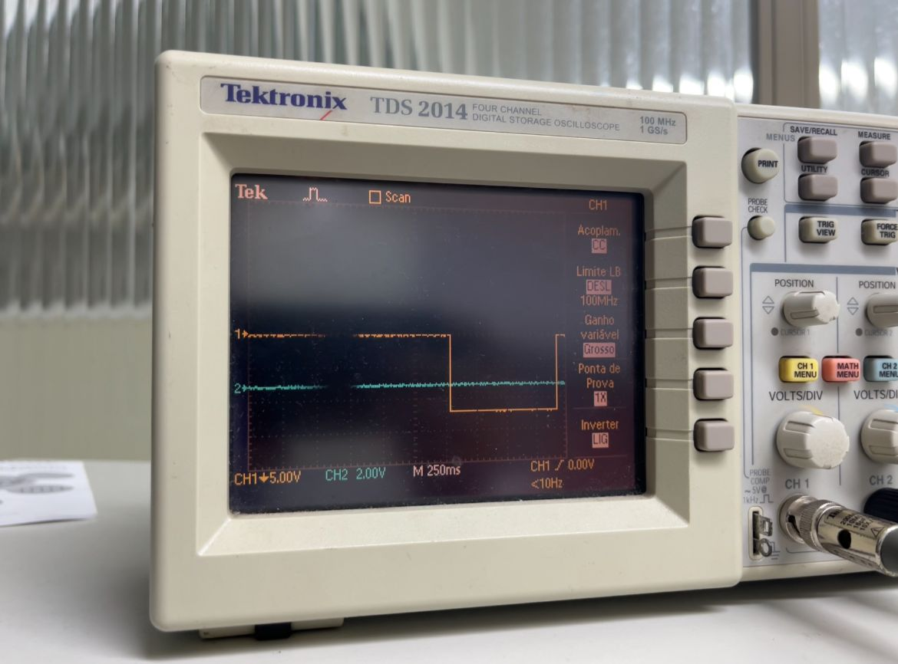

# Projeto Engenharia de Áudio

## X) Low-Frequency Oscillator (LFO)

Um LFO (Low-Frequency Oscillator) é um oscilador de baixa frequência usado em sintetizadores para modular algum parâmetro do som, ou seja, para fazer esse parâmetro variar ao longo do tempo de forma cíclica. O LFO, dependendo da sua construção, pode produzir os seguintes formatos de onda:
- Senoide;
- Triangular;
- Dente de Serra;
- Quadrada (para ligar/desligar de forma brusca).

O LFO utilizado no projeto se trata de um oscilador auxiliar baseado em um dos inversores do CD40106 Schmitt Trigger. Sua função é gerar um pulso periódico usado para sincronizar outro oscilador, o VCO (Voltage Controlled Oscillator. Para o LFO, foi utilizado o circuito descrito no vídeo [DIY Synth-40106 Oscillator with Sync](https://www.youtube.com/watch?v=FT-08mk-UgM).

### X.1) Princípio de Funcionamento

#### X.1.1) Controle da Frequência

O sistema do LFO atua com base no princípio de carregamento e descarregamento do capacitor de $15 \ \mu F$acoplado ao ground. Junto com os potenciômetros, ele define a velocidade da oscilação da seguinte forma:
- Quanto maior a resistência total, mais lentamente ele carregará. Isso resulta em uma frequência mais baixa;
- Quanto menor a resistência total, mais rapidamente ele carregará. Isso resulta em uma frequência mais alta;

Para ambos os potenciômetros, temos dois tipos de ajuste/controle:
- **Coarse (100k)**: Se trata de um ajuste forte, mais intenso. Altera a frequência de forma ampla;
- **Fine (10k)**: Se trata de um ajuste fino. Permite ajustes mais precisos.

Essa combinação permite ao oscilador ir desde ciclos extremamente lentos até mais rápidos, dependendo dos valores.

#### X.1.2) Geração da Onda Quadrada

O CD40106 tem histerese, ou seja, ele muda o estado de saída apenas quando o capacitor alcança certos limites (limite alto e baixo). Isso cria um oscilador de onda quadrada com as seguintes características:
- Quando a tensão do capacitor sobe acima do limiar, a saída vai para LOW (baixa);
- Quando cai abaixo do limiar, a saída vai para HIGH (alta).

#### X.1.3) Controle do VCO

A saída do LFO (onda quadrada) passa pelo diodo. Em cada borda (dependendo da polaridade do diodo), ele puxa o nó do primeiro capacitor do VCO para perto de Vcc ou para perto de 0 V, ou seja, injeta ou remove carga do capacitor do VCO.

### X.3) Simulação no LTspice

Antes da montagem do circuito, foi elaborado seu esquemático no software LTspice. Como o programa não disponibiliza componentes como potenciômetros e Schmitt triggers, algumas adaptações foram necessárias.

No caso dos potenciômetros, utilizaram-se resistores de valor equivalente. Embora essa solução não permita simular a variação contínua da resistência, ela possibilita a análise do circuito considerando o valor máximo do potenciômetro.

Para substituir o Schmitt trigger, empregou-se um circuito equivalente composto por um amplificador operacional genérico do LTspice, um resistor de $100 \ k \Omega$, outro de $470 \ k \Omega$ e uma fonte de alimentação de 5 V.

A alimentação do circuito foi realizada por meio de uma fonte de tensão senoidal.

O gráfico a seguir, ilustra o resultado da simulação.

Como podemos observar, o circuito recebe uma entrada senoidal (em azul) e produz uma saída na forma de uma onda quadrada (em verde). Esse resultado demonstra que a simulação produz um resultado esperado.

### X.2) Montagem do Circuito

A montagem do circuito foi feita utilizando os componentes especificados no vídeo de referência:
- 1 chip CD40106 (Schmitt Trigger);
- 1 potenciômetro de 100k $\Omega$;
- 1 potenciômetro de 10k $\Omega$;
- 1 resistor de 220 $\Omega$;
- 1 capacitor de $15 \mu F$;
- Conectores para protoboard;

A montagem co circuito ficou da seguinte forma:

O circuito funcionou conforme o esperado, produzindo a onda quadrada desejada. Nas figuras a seguir, nota-se que, ao ajustar a resistência nos potenciômetros, a largura dos pulsos da onda quadrada também é ajustada.

Como podemos observar, esta saída esta alinhada com o que se espera do circuito e também com a simulação apresentada anteriormente.

Os dois vídeos na pasta do projeto ilustram esse funcionamento de melhor forma.

## X) Voltage Controlled Filter (VCF)

Um VCF (Voltage Controlled Filter) é um filtro cuja frequência de corte pode ser modificada por uma tensão de controle. Em vez de ajustar a frequência manualmente com um potenciômetro, é possível modulá-la com sinais externos como LFOs, envelopes, sequenciadores ou qualquer outra fonte de tensão. Isso permite que o filtro se torne um elemento dinâmico no fluxo do sintetizador, alterando o caráter do som ao longo do tempo.

Assim como qualquer filtro, um VCF pode ser passa-baixas, passa-altas, passa-bandas ou uma combinação ajustável entre eles. A diferença fundamental é que ele responde à tensão, o que o torna especialmente útil na síntese subtrativa, onde controlar a abertura e fechamento do filtro é tão importante quanto escolher a forma de onda. Para este trabalho, foi utilizado o VCF do tipo KS-20, disponível no link [Filtro KS-20](https://kassu2000.blogspot.com/2019/07/ks-20-filter.html).

### X.1) Filtro KS-20

O KS-20 é um VCF baseado no clássico filtro do Korg MS-20, mas reconstruído com OTAs (Operational Transconductance Amplifiers) em vez do par de transistores do circuito original. Ele é formado por duas etapas de filtragem idênticas, cada uma construída em torno de um OTA configurado como integrador. Nessa configuração, o OTA funciona como um resistor variável controlado por corrente: quanto maior a corrente de controle, derivada da tensão de cutoff, menor a "resistência equivalente" e maior a frequência de corte do filtro. Assim, o KS-20 se comporta como um filtro totalmente controlável por tensão, mantendo a musicalidade e a instabilidade interessante do MS-20.

As duas etapas de OTA são encadeadas para formar diferentes configurações de filtragem. Quando o sinal entra pela entrada passa-baixas, ambas as etapas atuam juntas, resultando em um filtro passa-baixas de dois pólos (aproximadamente 12 dB/oitava). Já a entrada passa-altas usa o caminho interno de modo diferente: a ressonância é criada pela primeira etapa, mas o áudio filtrado é retirado da segunda, produzindo um passa-altas de um pólo (6 dB/oitava).

A ressonância, característica marcante do MS-20, é obtida realimentando o sinal de saída para a entrada, mas no KS-20 essa realimentação é intencionalmente não linear. Em vez de diodos tradicionais, o circuito utiliza LEDs, que possuem características de condução diferentes e introduzem distorções sutis quando o nível de sinal aumenta. Isso faz com que a ressonância mude de comportamento conforme a amplitude: em níveis baixos, ela soa limpa, já em níveis altos, passa a saturar. O controle de "drive" ajusta exatamente quanto dessa saturação aparece, permitindo desde um filtro suave até um som agressivo e "rasgado". O resultado é um filtro versátil, que combina a flexibilidade dos OTAs, garantindo controle de corte suave e previsível, com a crueza e o caráter da ressonância não linear inspirada no MS-20.

### X.2) Implementações

#### X.2.1) Simulação no LTspice

O circuito foi montado no LTspice a partir do esquema disponível na documentação do KS-20, porém não foi possível realizar testes significativos de sua operação. A figura 1 mostra a montagem do circuito no software LTspice.

A principal dificuldade surgiu da falta de clareza quanto aos pontos adequados para inserir o sinal de entrada e sobre qual nó deveria ser considerado a saída em cada modo de funcionamento do filtro. Como o KS-20 permite diferentes caminhos internos dependendo da entrada utilizada (passa-baixas ou passa-altas), tornou-se difícil estabelecer um arranjo de excitação que representasse de forma confiável o comportamento real do circuito. Além disso, a presença de elementos não lineares na malha de realimentação, como LEDs utilizados para modelar a saturação da ressonância, exige parâmetros mais precisos para que a simulação seja fiel. Assim, embora o circuito tenha sido implementado no ambiente de simulação, não foi possível obter resultados conclusivos sobre sua resposta ou sua dinâmica.

#### X.2.2) Montagem Física

A montagem física do KS-20 foi parcialmente realizada em uma protoboard, seguindo fielmente a lista de componentes fornecida pela referência. O circuito foi montado utilizando alguns dos componentes a seguir:
- 2 AmpOps LM13700;
- 2 AmpOps NE5532;
- 1 AmpOp TL072;
- 4 Resistores 220 $\Omega$;
- 2 Resistores 4.7k $\Omega$;
- 6 Resistores 10k $\Omega$;
- 1 Resistor 47k $\Omega$;
- 1 Resistor 100k $\Omega$;
- 2 Capacitores 1 nF;
- 1 Capacitor 470 nF;
- 2 LEDs.

A reprodução do circuito seguiu fielmente o esquema original, sem modificações, mantendo a organização necessária para acomodar as duas etapas baseadas em OTAs e os elementos da malha de realimentação. No entanto, assim como ocorreu na simulação, não foi possível testar efetivamente o funcionamento do filtro. Alguns dos componentes chegaram próximo ao prazo final de entrega do projeto e, além disso, estavam na forma SMD. Devido às limitações de tempo, a equipe da universidade responsável pela soldagem não conseguiu realizar o serviço a tempo, impossibilitando a montagem dos componentes na protoboard por parte da equipe.
